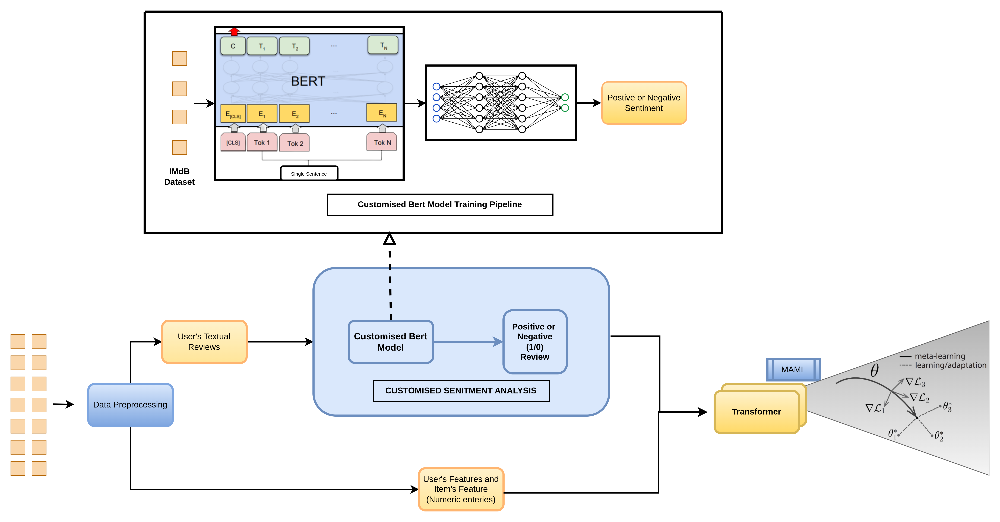

# Update Latest Code

# Recommender_system

The transformer predicts ranking and loss is calculated with help of this. 
Finally, while functioning with help of this ranking we arrange items in descending order. Highest rating is at top. 

# Algorithm:

# Results :
Below are the plots:
1. Loss: The cross-entropy loss between prediction and correct labels
2. Accuracy: The mean of correct predictions in an epoch.
