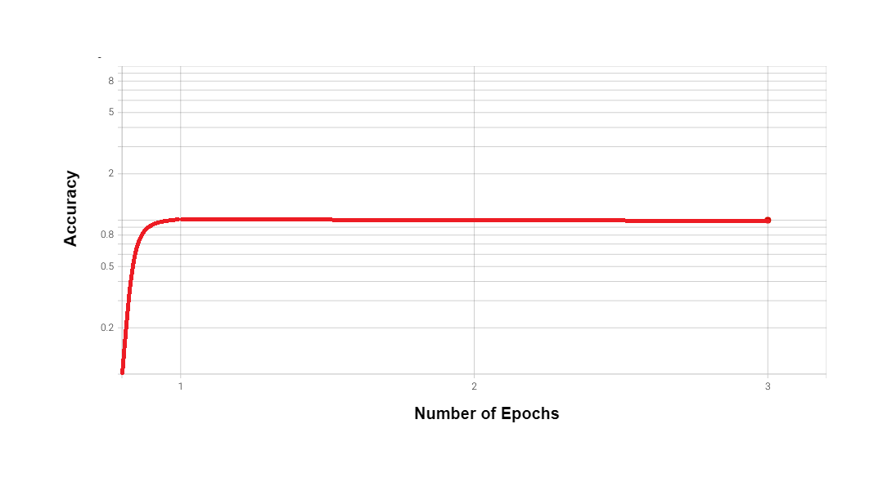
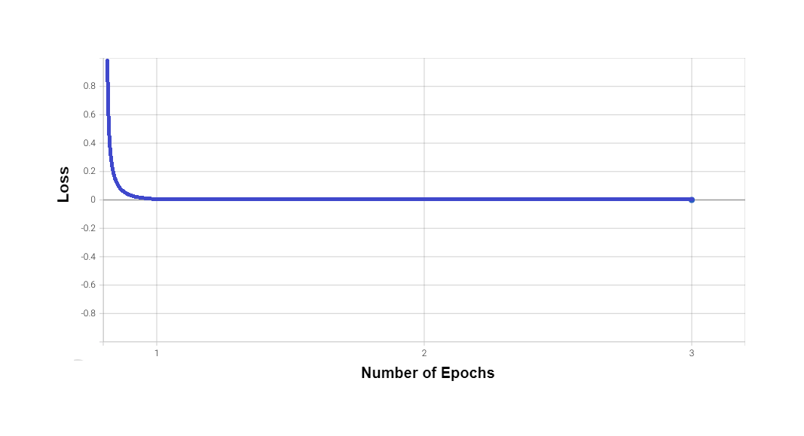

# Recommender_system

The "Personalized Recommendation System Project" aims to develop and implement an advanced recommendation system that tailors content and product suggestions to individual users' preferences. The project leverages state-of-the-art algorithms and techniques to enhance user experience and engagement on a digital platform.

This project recognizes the challenges posed by information overload in today's digital landscape and addresses them by providing users with personalized recommendations. By analyzing users' historical interactions, preferences, and contextual information, the system aims to curate suggestions that align with users' interests.

# Algorithm:
  
 
Our algorithm is divided into two parts:
1. The first part deals with sentiment analysis, the textual data can't be directly used in normal transformers. To leverage information from the text review, we customized the BERT for sentiment analysis. We trained the customized BERT model on the IMdB dataset of movie reviews (as shown in the image).
2. The second part of the algorithm is combined the pre-trained BERT with the final pipeline of training on the clothing dataset. We used transformers which are capable of using and interpreting the relation between data far apart. Further to improve the performance, we have used the MAML (Model-Agnostic Meta-Learning) algorithm to further boost the performance.

# Results :

Below are the plots:
1. Loss: The cross-entropy loss between prediction and correct labels
2. Accuracy: The mean of correct predictions in an epoch per prediction. So, this is in fraction. 
   

# Contributors :
1. <a href ="https://github.com/AYUSH-ISHAN">Ayush Ishan</a>
2. <a href ="https://github.com/RITIK160104">Ritik Narang</a>
3. <a href ="https://github.com/Sanskar-gour">Sanskar Gour</a>
